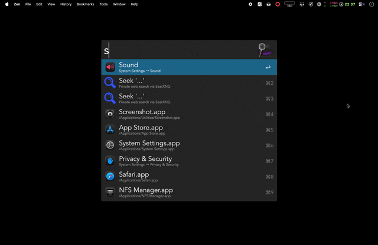

# Seek: Alfred Workflow for SearXNG

[](https://github.com/ggfevans/searxng-seek-alfred/releases)
[](https://github.com/ggfevans/searxng-seek-alfred/releases/latest)
[](LICENSE)

An [Alfred](https://www.alfredapp.com/) workflow for private web search via [SearXNG](https://docs.searxng.org/). Optimized for personal instances, works with public instances too.

<p align="center">
  
</p>

## Features

- **Inline results** - Search results appear directly in Alfred
- **Website favicons** - See site icons next to results (optional)
- **Fallback search** - Use as your default web search instead of Google
- **Quick actions** - Open, copy URL, or view in SearXNG web UI

## Installation

1. Download the latest `.alfredworkflow` from [Releases](https://github.com/ggfevans/searxng-seek-alfred/releases/latest)
2. Double-click to install in Alfred
3. Configure your SearXNG URL in the workflow settings

## Usage

Search the web privately via the `sx` keyword. Alternative keyword `seek` also available (both configurable in settings):

| Key | Action |
|-----|--------|
| <kbd>Return</kbd> | Open result in browser |
| <kbd>Cmd</kbd>+<kbd>Return</kbd> | Copy URL to clipboard |
| <kbd>Option</kbd>+<kbd>Return</kbd> | Open in SearXNG web interface |
| <kbd>Shift</kbd> | Quick Look preview |

### Use as Default Web Search

You can replace Google as your fallback search:

1. Open Alfred Preferences → Features → Default Results
2. Click "Setup fallback results" at the bottom
3. Click + and add "Seek"
4. Drag it above Google (or remove Google)

Now typing anything and pressing Enter searches SearXNG.

## Configuration

Configure in Alfred Preferences → Workflows → Seek → Configure Workflow:

| Setting | Required | Description |
|---------|----------|-------------|
| SearXNG URL | Yes | Your instance URL (e.g., `https://search.example.com`) |
| Search Keyword | Yes | Primary trigger keyword (default: `sx`) |
| Alternative Keyword | No | Secondary trigger keyword (default: `seek`). Leave empty to disable. |
| Timeout (ms) | No | Request timeout, default 5000 |
| Secret Key | No | For favicon support (see below) |

### SearXNG Instance Setup

Your SearXNG instance needs JSON format enabled in `settings.yml`:

```yaml
search:
  formats:
    - html
    - json
```

### Favicons (Optional)

To display website favicons in results:

1. Enable favicon resolver in your SearXNG `settings.yml`:
   ```yaml
   search:
     favicon_resolver: "duckduckgo"
   ```

2. Copy the `secret_key` from your SearXNG `settings.yml` into the workflow configuration

Favicons are fetched through your SearXNG instance's proxy, preserving privacy.

### Using with Public Instances

Seek works with any SearXNG instance that has JSON format enabled — including public instances like [searx.be](https://searx.be) or others from [searx.space](https://searx.space).

**Limitations with public instances:**
- Favicons unavailable (requires secret_key access)
- May have rate limits or usage restrictions
- Privacy depends on the instance operator

For full features and privacy, self-hosting is recommended.

## Security

### About the Secret Key

The `secret_key` is used for HMAC authentication with SearXNG's favicon proxy. It only enables proxy access for fetching favicons — it does **not** grant admin access or expose search history.

### Where It's Stored

The secret key is stored in Alfred's workflow configuration:

```
~/Library/Application Support/Alfred/Alfred.alfredpreferences/workflows/
```

This location is:
- Protected by macOS file permissions (user-only readable)
- Included in Alfred Sync if enabled (Dropbox/iCloud)
- Included in Time Machine and other backups

### Risk Assessment

**Low sensitivity**: The worst-case scenario if someone obtains your secret key is that they could use your SearXNG instance's favicon proxy. They cannot access your searches, modify settings, or gain admin access.

### Recommendations

For privacy-conscious users:
- **Option 1**: Leave the secret key blank to disable favicons entirely
- **Option 2**: Exclude Alfred preferences from sync services
- **Option 3**: Use a dedicated SearXNG instance for this workflow

## Requirements

- macOS with [Alfred 5+](https://www.alfredapp.com/) and Powerpack
- A SearXNG instance with JSON format enabled

## License

[MIT](LICENSE)
